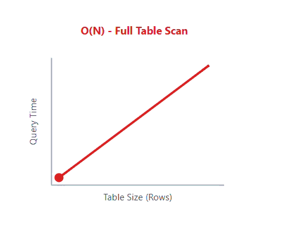
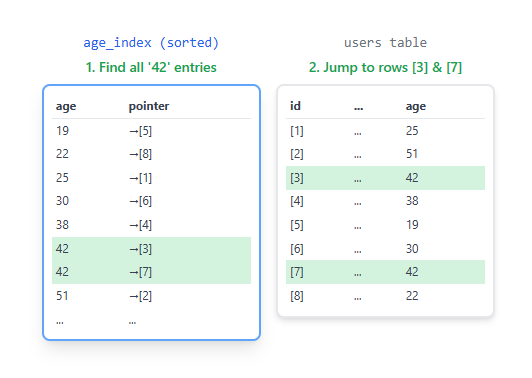
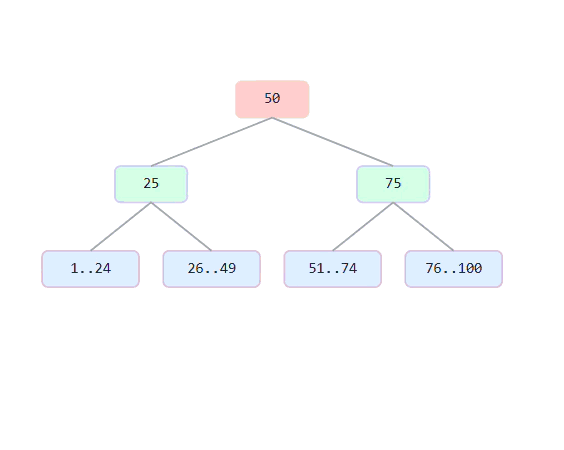

## What is a Database Index? {.center}

:::{.fragment}
An index is a **data structure** that improves the speed of data retrieval operations.
:::

:::{.fragment}
This is another object in the database that references the data in tables.
:::

:::{.fragment}
*Indexes speed up SELECT queries but slow down INSERT/UPDATE/DELETE*
:::

---

## A Simple Analogy 📚

:::{.center}
Think of an index as the **index** at the back of a book.
:::

:::{.fragment}

- Without an index: You'd have to read every page to find a topic
- With an index: You jump directly to the page number
- Database without index: Scans every row (FULL TABLE SCAN)
- Database with index: Jumps directly to matching rows

:::

---

## So, Why Use Indexes? 🚀

Indexes are essential for improving database performance:

:::{.fragment}

- **Faster Query Performance**: Significantly reduces the time taken to retrieve data.

:::

:::{.fragment}

- **Efficient Data Access**: Optimizes search operations, especially on large datasets.

:::

:::{.fragment}

- **Reduced I/O Operations**: Minimizes the amount of data read from disk.

:::

:::{.fragment}

- **Improved Join Performance**: Speeds up join operations between tables.

:::


---

## Full Table Scan 

:::: {.columns}
::: {.column width="60%"}
::: {.content-visible when-format="html"}
{width="80%"}
:::

::: {.content-visible when-format="pdf"}
{width="80%"}
:::
:::

::: {.column width="40%"}
<br>
<br>

- This is a Full Table Scan.
- Databases do this by default.
- It's a huge performance bottleneck for large tables.

:::

::::

---

## Performance Cost: Linear Growth

:::: {.columns}
::: {.column width="60%"}
::: {.content-visible when-format="html"}
{width="100%"}
:::

::: {.content-visible when-format="pdf"}
{width="100%"}
:::
:::
::: {.column width="40%"}
<br>
<br>

- Full Table Scan performance is directly proportional to table size
- O(N) complexity
- Double the data = double the wait time
- Linear scaling is the enemy of fast applications

:::
::::


## The Solution: The Database Index

:::: {.columns}
::: {.column width="60%"}

:::
::: {.column width="40%"}
<br>
<br>

- An index is like a book's index: a separate, sorted structure that points directly to the data's location.
- Instead of scanning the whole table, RDBMS uses the index to find all matching rows instantly.

:::
::::

---

## Performance Gain: Logarithmic Growth

:::: {.columns}
::: {.column width="60%"}
::: {.content-visible when-format="html"}
{width="80%"}
:::

::: {.content-visible when-format="pdf"}
{width="80%"}
:::
:::
::: {.column width="40%"}
<br>
<br>

- An Index Scan's performance barely changes, even when the table grows exponentially.
- This is O(log N) complexity.
- The magic of an index: Ten times the data might not even add a millisecond to your query.
- This is why indexes are critical for scaling.

:::
::::

---

## The Golden Trade-Off

Indexes are not free. They create a fundamental trade-off.

- **FASTER Reads (SELECT)**: Queries on indexed columns are dramatically faster.
- **SLOWER Writes (INSERT, UPDATE, DELETE)**: Postgres must do extra work to update the index too.


# How Indexes Work Internally

## Physical Storage of Indexes

:::{.fragment}
Indexes are stored as **separate data structures** on disk, independent of the table data.
:::

:::{.fragment}
Each index occupies its own space and requires maintenance on every data modification.
:::

:::{.fragment}
PostgreSQL uses **pages** (8KB blocks) to store both table data and index data.
:::

---

## B-Tree Index Structure 🌳

:::{.fragment}
**B-Tree** (Balanced Tree) is the default and most versatile index type in PostgreSQL.
:::

## The Structure of an Index: The B-Tree

:::: {.columns}
::: {.column}
::: {.content-visible when-format="html"}
{width="80%"}
:::

::: {.content-visible when-format="pdf"}
{width="80%"}
:::
:::
::: {.column}

- **Root Node**: Entry point
- **Internal Nodes**: Navigation
- **Leaf Nodes**: Point to data

:::
::::

---

## B-Tree search

:::: {.columns}
::: {.column}
::: {.content-visible when-format="html"}
{width="80%"}
:::

::: {.content-visible when-format="pdf"}
{width="80%"}
:::
:::

::: {.column}

- Keys are always kept in sorted order within each node.
- This allows for incredibly fast searching.
- Just like finding a word in a dictionary, the database can make a quick decision at each step to narrow down the search.

:::
::::

---

## How B-Tree Search Works

:::{.incremental}
1. **Start at Root**: Compare search value with root node
2. **Navigate Down**: Follow pointer to appropriate child node
3. **Repeat**: Continue until reaching leaf node
4. **Find Data**: Leaf node contains pointer to actual table row
:::

:::{.fragment}
### Example: Finding value 30
```text
Root (50) → Go Left → Internal (25) → Go Right → Leaf [26-49]
```
:::

:::{.fragment}
### Example: Finding value 80
```text
Root (50) → Go Right → Internal (75) → Go Right → Leaf [76-100]
```
:::


## B-Tree Page Structure

:::: {.columns}
::: {.column width="60%"}
Each node is stored in one or more **pages**:

:::{.fragment}
```text
┌──────────────────────┐
│   Page               │
├──────────────────────┤
│   Index Tuples       │
│   (Key + Pointer)    │
└──────────────────────┘
```
:::
:::

::: {.column width="40%"}
:::{.fragment}

- **Keys**: contain the indexed column values like 1, 25, 50, 75
- **Pointers**:  point to child nodes or actual table rows

:::
:::
::::

---

## B-Tree Leaf Nodes
:::: {.columns}
::: {.column width="60%"}
Leaf nodes contain the actual pointers to the table rows.

:::{.fragment}
```text
┌─────────────────────────────┐
│   Leaf Page                 │
├─────────────────────────────┤
│   Key: 1   → Pointer to Row │
│   Key: 2   → Pointer to Row │
│   Key: 3   → Pointer to Row │
│   ...                       │
│   Key: 100 → Pointer to Row │
└─────────────────────────────┘
```
:::
:::
::::


# Creating and Verifying Indexe

## Single Column Index

The SQL syntax for creating an index is straightforward. A common naming convention is `idx_tablename_columnname`.

```sql
-- For a single column:
CREATE INDEX idx_users_username 
ON users (username);
```


## Confirm index creation

```sql
SELECT indexname, indexdef 
FROM pg_indexes 
WHERE tablename = 'users';
```

**Expected Output:**
```text
indexname                     | indexdef
------------------------------|------------------------------------------
users_pkey                    | CREATE UNIQUE INDEX users_pkey ON users USING btree (id)
idx_users_username            | CREATE INDEX idx_users_username ON users USING btree (username)
```


::: notes
\d users allows you to view the table structure and all indexes associated with the users table.

:::


## Primary Keys - Automatic Index

PostgreSQL automatically creates a **unique B-tree index** on primary key columns. For foreign keys and relationships, **indexes are essential but not automatic**.


## Multi-Column (Composite) Indexes

You can index multiple columns for queries that filter on several fields at once.

```sql
CREATE INDEX idx_users_fullname 
ON users (first_name, last_name);
```

::: notes
Important: The order of columns matters! `(last_name, first_name)` is not the same as `(first_name, last_name)`.
:::

## Confirm Composite Index Creation

```sql
SELECT indexname, indexdef 
FROM pg_indexes 
WHERE tablename = 'users';
```

**Expected Output:**
```text
indexname                     | indexdef
------------------------------|------------------------------------------
users_pkey                    | CREATE UNIQUE INDEX users_pkey ON users USING btree (id)
idx_users_username            | CREATE INDEX idx_users_username ON users USING btree (username)
idx_users_fullname            | CREATE INDEX idx_users_fullname ON users USING btree (first_name, last_name)
```
 

## Dropping Index

```sql
DROP INDEX index_name;
```


## Index Maintenance

### Dropping unused indexes
```sql
-- Remove an index if it's not being used
DROP INDEX idx_customer_last_name;
```

### Reindexing for maintenance
```sql
-- Rebuild an index to optimize it
REINDEX INDEX idx_customer_last_name;

-- Rebuild all indexes on a table
REINDEX TABLE customers;
```

---

## Unique Indexes

### Enforcing data uniqueness
```sql
-- Create unique index to prevent duplicate emails
CREATE UNIQUE INDEX idx_customers_email_unique 
ON customers (email);

-- This will fail if email already exists
INSERT INTO customers (email, name) 
VALUES ('existing@email.com', 'John Doe');
```

---

## Performance Tips

:::{.fragment}

- ✅ **Index foreign keys** - JOIN operations will be faster

:::

:::{.fragment}

- ✅ **Index WHERE clause columns** - Especially in frequent queries

:::

:::{.fragment}

- ✅ **Index ORDER BY columns** - Sorting will be faster

:::

:::{.fragment}

- ✅ **Monitor index usage** - Remove unused indexes

:::

:::{.fragment}

- ✅ **Consider composite indexes** - For multi-column WHERE clauses

:::


## Real-World Example

```sql
-- Products table with proper indexes
CREATE TABLE products (
    product_id SERIAL PRIMARY KEY,  -- Automatic index
    name VARCHAR(255),
    category_id INTEGER,
    price DECIMAL(10,2),
    created_date DATE,
    status VARCHAR(20)
);

-- Strategic indexes
CREATE INDEX idx_products_category ON products (category_id);
CREATE INDEX idx_products_price ON products (price);
CREATE INDEX idx_products_status_date ON products (status, created_date);
```

---

## Common Mistakes to Avoid

:::{.fragment}

- 🚫 **Creating too many indexes** - Slows down writes

:::

:::{.fragment}

- 🚫 **Not monitoring index usage** - Wasted storage space

:::

:::{.fragment}

- 🚫 **Wrong column order in composite indexes** - Put most selective column first

:::

:::{.fragment}

- 🚫 **Indexing everything** - Each index has overhead

:::


# Query Optimization


## The Explain Command

:::{.fragment}
`EXPLAIN` shows how PostgreSQL will execute a query - the **query execution plan**.
:::

:::{.fragment}
```sql
EXPLAIN
SELECT * FROM users WHERE username = 'john_doe';
```
:::

:::{.fragment}
Expected Output:
```text
                        QUERY PLAN
-----------------------------------------------------------
 Index Scan using idx_users_username on users  (cost=0.29..8.31
  rows=1 width=128)
    Index Cond: (username = 'john_doe')
(1 row)
```
:::

## Anatomy of a Query Plan

```text
                        QUERY PLAN
-----------------------------------------------------------
 Index Scan using idx_users_username on users  (cost=0.29..8.31
  rows=1 width=128)
    Index Cond: (username = 'john_doe')
(1 row)
```

:::{.fragment}
Each line describes an operation. Let's break down the key parts:

- **Node Type**: The type of operation (e.g., Index Scan)
- **Cost**: The planner's estimate of the work required
  - PostgreSQL doesn’t measure cost in milliseconds 
  — it uses relative units so it can compare plans independently of hardware speed.
Each action (CPU step, disk read, etc.) has a weight:
- **Rows**: The estimated number of rows this operation will return
- **Width**: The average size (in bytes) of each row

:::


## Decoding the 'Cost'

- **Startup Cost**: The cost before the first row can be returned
- **Total Cost**: The estimated total cost to execute the operation


## Common Node Types

- Seq Scan (Sequential Scan)
Reads the entire table row by row. Used when no suitable index exists or when most rows need to be read anyway.

- Index Scan
Uses an index to locate matching rows directly, fetching only the necessary tuples from the table.

- Nested Loop Join
Iterates over rows from one table and, for each row, searches for matching rows in another table. Efficient for small datasets or when the inner table is indexed.

## Common Node Types

- Aggregate / Group / Filter / Limit / Sort
Additional operations applied after scanning or joining — used for grouping, filtering, ordering, and limiting results.

- Hash Join
Builds a hash table from one input (the smaller one) and probes it with rows from the other input — very efficient for large, unindexed joins.

- Merge Join
(Optional addition) Joins two sorted datasets efficiently by walking through both in order.


## The Explain Analyze Command

:::{.fragment}
`EXPLAIN ANALYZE` actually runs the query and shows real execution time.
:::

:::{.fragment}
```sql
EXPLAIN ANALYZE
SELECT * FROM users WHERE username = 'john_doe';
```
:::

**Expected Output:**
```text  
-----------------------------------------------------------
  Seq Scan on users  (cost=0.00..180.00 rows=1 width=128) 
                    (actual time=0.234..12.456 rows=1 loops=1)
    Filter: (username = 'john_doe')
    Rows Removed by Filter: 9999
Planning Time: 0.123 ms
Execution Time: 12.678 ms
```

## Reading the `ANALYZE` Output

```text
-----------------------------------------------------------
  Seq Scan on users  (cost=0.00..180.00 rows=1 width=128)
                    (actual time=0.234..12.456 rows=1 loops=1)
    Filter: (username = 'john_doe')
    Rows Removed by Filter: 9999
Planning Time: 0.123 ms
Execution Time: 12.678 ms
```

- **actual time**: Time taken for this operation during execution
- **rows**: Actual number of rows returned
- **loops**: How many times this operation was executed (for nested loops)
- **Rows Removed by Filter**: Number of rows filtered out

## When to Use Explain vs Explain Analyze

- Use `EXPLAIN` when you want to see the estimated plan without executing the query. This is useful for understanding how PostgreSQL intends to execute a query and for planning optimizations without affecting the database state.
  - **Example**: You might use it before making changes to a query to see if those changes will improve performance.
  - **Note**: The output is based on statistics and may not reflect the actual execution.

- Use `EXPLAIN ANALYZE` when you want to see the actual execution plan along with real performance metrics. This is helpful for diagnosing performance issues and verifying if the query is running as expected.


## Plan 1: Before Index (Slow)

```sql
EXPLAIN ANALYZE
SELECT * FROM users WHERE username = 'john_doe';
```

:::{.fragment}
```text
Seq Scan on users  (cost=0.00..180.00 rows=1 width=128) 
                   (actual time=0.234..12.456 rows=1 loops=1)
  Filter: (username = 'john_doe')
  Rows Removed by Filter: 9999
Planning Time: 0.123 ms
Execution Time: 12.678 ms
```
:::

:::{.fragment}
**Sequential Scan**: Scanned all 10,000 rows to find 1 match! ⚠️
:::

---

## Plan 2: After Index (Fast)

```sql
CREATE INDEX idx_users_username ON users (username);

EXPLAIN ANALYZE
SELECT * FROM users WHERE username = 'john_doe';
```

:::{.fragment}
```text
Index Scan using idx_users_username on users  
  (cost=0.29..8.31 rows=1 width=128) 
  (actual time=0.045..0.047 rows=1 loops=1)
  Index Cond: (username = 'john_doe')
Planning Time: 0.156 ms
Execution Time: 0.089 ms
```
:::

:::{.fragment}
**Index Scan**: Found the row directly! 🚀

**142x faster!** (12.678ms → 0.089ms)
:::

---


## Summary

:::{.center}
**Indexes are powerful tools for query optimization**
:::

:::{.fragment}

- Use them strategically on frequently queried columns
- Monitor their usage with EXPLAIN
- Balance read performance vs write overhead
- Remove unused indexes periodically

:::

:::{.fragment}
**Remember: Measure, don't guess!** 📊
:::


